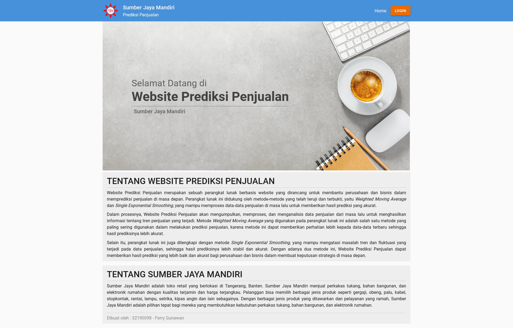
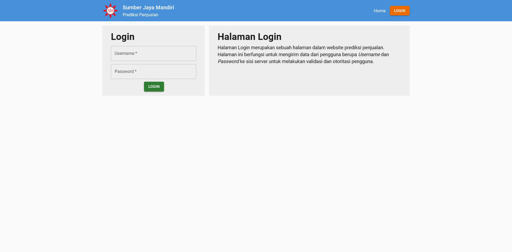
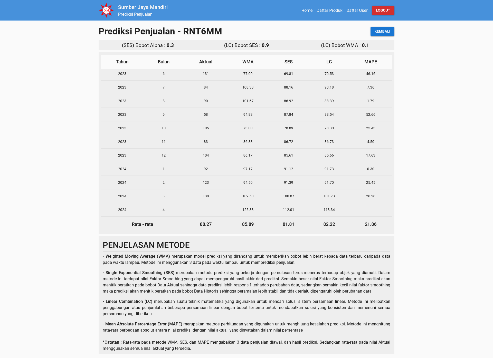

# Website-Prediksi-Penjualan

- Dibuat untuk kepentingan **Skripsi**.
- Menggunakan metode _Weighted Moving Average_ dan _Single Exponential Smoothing_ dalam melakukan prediksi penjualan.
- Menggunakan metode _Mean Absolute Percentage Error_ untuk mengukur tingkat kesalahan.
- Menyimpan Data Produk & Data Penjualan dari masing - masing produk.
- Autentikasi dan Otoritasi pengguna.

Website ini dibuat menggunakan teknologi :
**_React, Material UI, NodeJS, Express, MySQL_**

# Tampilan Website

## Halaman Home

## Halaman Login

## Halaman Daftar Produk

## Halaman Tambah / Edit Produk

 

## Halaman Daftar Penjualan

## Halaman Tambah / Edit Penjualan

 

## Halaman Prediksi

## Halaman Daftar User

## Halaman Tambah / Edit User

 

## Halaman User Log

